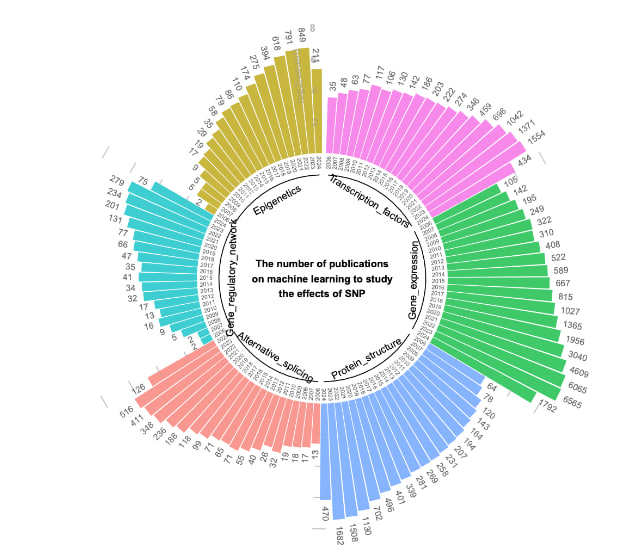

# Parsing_NCBI
Парсинг сайта на Python, создание графиков на R

Данные собрала через парсинг с помощью selenium и BeautifulSoup
Картинку в R сделала. В итоге получилась чледующая картинка:

The number of publications for ML in different effects of SNP researches during the years from 2006 to 2024

